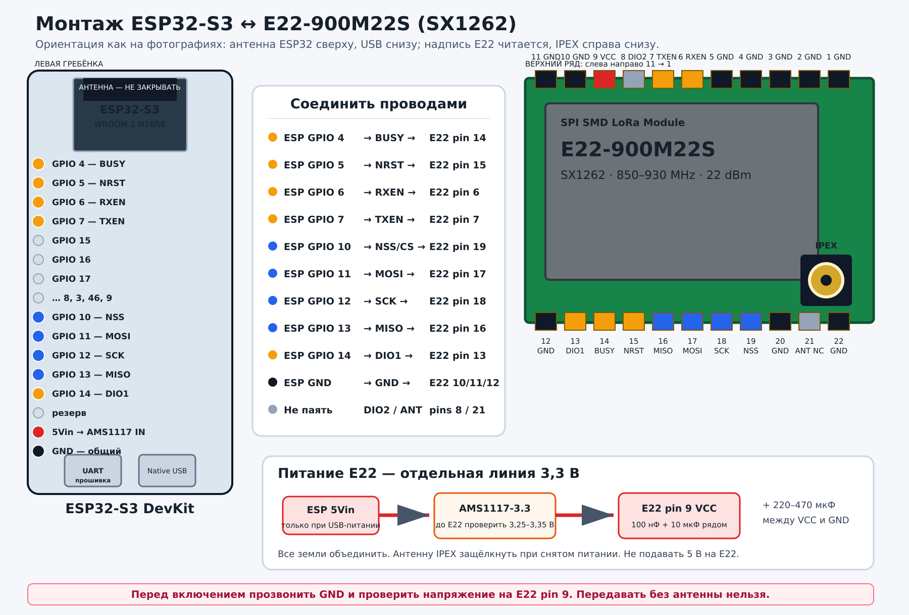

# Подробная инструкция по распайке

Эта инструкция относится только к следующей связке:

- ESP32-S3 DevKitC-1-совместимая плата на ESP32-S3-WROOM-1 N16R8,
  44 контакта, два USB-C;
- SPI-модуль EBYTE **E22-900M22S** на SX1262, 22 контактные площадки и
  разъём IPEX/U.FL;
- отдельный стабилизатор 3,3 В для радиомодуля.

У EBYTE есть внешне похожие UART-модули с выводами `M0`, `M1`, `RXD`, `TXD` и
`AUX`. Эта схема к ним не подходит. До пайки сверьте полную маркировку модуля.

> **Критически важно:** E22 нельзя питать от 5 В. Антенну подключают и
> отключают только при полностью снятом питании. Не включайте передачу без
> подходящей антенны 868–928 МГц.



## Что потребуется

- ESP32-S3 DevKitC-1 N16R8;
- E22-900M22S;
- стабилизатор 3,3 В с реальным запасом по импульсному току; в исходной сборке
  использован модуль AMS1117-3.3;
- керамический конденсатор 100 нФ;
- конденсатор 10 мкФ;
- электролитический конденсатор 220–470 мкФ с рабочим напряжением не ниже 6,3 В;
- тонкий многожильный провод для сигналов и более толстый — для питания/GND;
- флюс, припой, паяльник с тонким жалом, пинцет;
- мультиметр с измерением напряжения и прозвонкой;
- подходящая 50-омная антенна с IPEX/U.FL-пигтейлом.

Для макетной сборки SPI и управляющие провода должны быть короче 10 см, а
питание и земля — ещё короче. Длинные Dupont-провода для радиомодуля дают
просадки питания и нестабильный SPI.

## Ориентация модулей

### ESP32-S3

Положите DevKit печатной Wi-Fi/BLE-антенной вверх, разъёмами USB-C вниз. Все
используемые сигналы находятся на левой гребёнке. Её порядок сверху вниз у
платы исходной сборки:

```text
3V3, 3V3, RST, 4, 5, 6, 7, 15, 16, 17, 18,
8, 3, 46, 9, 10, 11, 12, 13, 14, 5Vin, GND
```

Не ориентируйтесь только на физический номер контакта гребёнки: у клонов
DevKit порядок может отличаться. Перед пайкой прочитайте подпись GPIO на своей
плате и сверьтесь с её pinout.

### E22-900M22S

Положите модуль экраном вверх, чтобы надпись `E22-900M22S` читалась
горизонтально, а IPEX находился справа снизу.

Верхний ряд слева направо идёт от контакта 11 к контакту 1:

| Номер | 11 | 10 | 9 | 8 | 7 | 6 | 5 | 4 | 3 | 2 | 1 |
| --- | --- | --- | --- | --- | --- | --- | --- | --- | --- | --- | --- |
| Сигнал | GND | GND | VCC | DIO2 | TXEN | RXEN | GND | GND | GND | GND | GND |

Нижний ряд слева направо идёт от контакта 12 к контакту 22:

| Номер | 12 | 13 | 14 | 15 | 16 | 17 | 18 | 19 | 20 | 21 | 22 |
| --- | --- | --- | --- | --- | --- | --- | --- | --- | --- | --- | --- |
| Сигнал | GND | DIO1 | BUSY | NRST | MISO | MOSI | SCK | NSS | GND | ANT | GND |

Контакты 20–22 расположены прямо под IPEX. При использовании IPEX контакт 21
`ANT` оставьте неподключённым: не припаивайте к нему провод и не замыкайте его
на соседние земли.

## Полная таблица соединений

| Функция | ESP32-S3 | E22 | Направление относительно ESP32 | Цвет провода, пример |
| --- | ---: | ---: | --- | --- |
| BUSY | GPIO4 | pin 14 | вход | жёлтый |
| NRST | GPIO5 | pin 15 | выход, активный 0 | оранжевый |
| RXEN | GPIO6 | pin 6 | выход, активный 1 | фиолетовый |
| TXEN | GPIO7 | pin 7 | выход, активный 1 | серый |
| NSS / CS | GPIO10 | pin 19 | выход | синий |
| MOSI | GPIO11 | pin 17 | выход | голубой |
| SCK | GPIO12 | pin 18 | выход | белый |
| MISO | GPIO13 | pin 16 | вход | зелёный |
| DIO1 / IRQ | GPIO14 | pin 13 | вход | коричневый |
| 3,3 В радио | выход стабилизатора | pin 9 | питание | красный |
| Общая земля | GND | GND-площадки | питание | чёрный |

`DIO2` E22 pin 8 в этой сборке не подключается. GPIO0, GPIO3, GPIO45 и GPIO46
не используются, потому что связаны с загрузкой ESP32-S3. GPIO19/20 оставлены
USB, GPIO43/44 — UART, GPIO48 — встроенному RGB-светодиоду.

На навесной сборке соедините с общей землёй как минимум несколько GND-площадок
E22 рядом с питанием и сигнальной группой, например 10, 11, 12, 20 и 22. На
собственной печатной плате все GND-площадки следует посадить на сплошной
земляной полигон согласно рекомендациям производителя модуля.

## Питание радиомодуля

Питание прокладывается отдельно от сигнальных проводов:

```text
USB → ESP32-S3 DevKit → 5Vin → IN стабилизатора 3,3 В
ESP GND ────────────────→ GND стабилизатора ─→ GND E22
                            OUT 3,3 В ─────────→ E22 pin 9 VCC
```

Не определяйте выводы AMS1117 по положению на фотографии: распиновка готовых
модулей различается. Используйте подписи `IN`, `GND`, `OUT` на своей плате и
проверьте их мультиметром.

Конденсаторы устанавливаются между E22 pin 9 и ближайшей землёй:

- 100 нФ — максимально близко к площадке VCC;
- 10 мкФ — рядом с ним;
- 220–470 мкФ — на той же 3,3-вольтовой шине возле E22.

У электролитического конденсатора обязательно соблюдайте полярность: `+` к
3,3 В, `−` к GND. Стабилизатор питает только E22. Логические уровни ESP32 и
E22 совместимы по 3,3 В, преобразователь уровней не нужен.

## Порядок пайки

### 1. Подготовьте рабочее место

Полностью отключите USB и любое внешнее питание. Разрядите статический заряд,
зафиксируйте обе платы и заранее нарежьте провода по длине. Разместите E22 так,
чтобы его IPEX оставался доступен, а металлический экран и провода не
перекрывали печатную Wi-Fi-антенну ESP32.

### 2. Залудите площадки

Нанесите немного флюса и минимальное количество припоя на нужные площадки E22
и концы проводов. Не создавайте высокие капли: шаг площадок небольшой, и мост
между соседними контактами трудно заметить. После каждой группы осматривайте
пайку под увеличением.

### 3. Проверьте стабилизатор отдельно

Не подключая E22, подайте USB-питание на DevKit и измерьте выход
стабилизатора. Нужны стабильные 3,25–3,35 В. Если там 5 В, напряжение плавает
или стабилизатор заметно нагревается без нагрузки — немедленно обесточьте
сборку и исправьте питание.

После проверки снова полностью отключите USB.

### 4. Припаяйте землю и питание

Сначала соедините общую землю ESP32, стабилизатора и E22. Затем припаяйте
выход 3,3 В к E22 pin 9 и установите конденсаторы. В последнюю очередь
соедините `5Vin` DevKit со входом стабилизатора.

Не подавайте одновременно питание через USB и отдельный источник на `5Vin`,
если документация конкретной DevKit прямо не разрешает такую схему: возможна
обратная подпитка USB-порта.

### 5. Припаяйте SPI

Паяйте и сразу прозванивайте по одному проводу:

1. GPIO10 → E22 pin 19 `NSS`;
2. GPIO11 → E22 pin 17 `MOSI`;
3. GPIO12 → E22 pin 18 `SCK`;
4. GPIO13 → E22 pin 16 `MISO`.

Особенно легко перепутать MISO и MOSI. Названия указаны со стороны ESP32:
MOSI идёт **из ESP32 в E22**, MISO — **из E22 в ESP32**.

### 6. Припаяйте управление

1. GPIO14 → E22 pin 13 `DIO1`;
2. GPIO4 → E22 pin 14 `BUSY`;
3. GPIO5 → E22 pin 15 `NRST`;
4. GPIO6 → E22 pin 6 `RXEN`;
5. GPIO7 → E22 pin 7 `TXEN`.

RXEN и TXEN управляют внешним RF-переключателем E22:

| Режим | RXEN | TXEN |
| --- | ---: | ---: |
| ожидание / запуск | 0 | 0 |
| приём | 1 | 0 |
| передача | 0 | 1 |

Состояние `RXEN=1` и `TXEN=1` недопустимо. Его исключает опубликованный target
прошивки; не проверяйте эти линии ручной подачей высокого уровня одновременно.

### 7. Подключите антенну

Убедитесь, что питание снято. Совместите IPEX строго по вертикали и аккуратно
нажмите на разъём до защёлкивания. Не давите сбоку и не вращайте защёлкнутый
коннектор. Пигтейл закрепите отдельно, чтобы нагрузка не приходилась на
миниатюрный разъём модуля.

### 8. Выполните контроль до включения

В режиме прозвонки проверьте:

- все точки GND соединены между собой;
- каждый сигнальный провод приходит только на указанный GPIO и E22 pin;
- соседние площадки E22 не замкнуты припоем;
- 5Vin не соединён с E22 pin 9;
- VCC E22 не имеет постоянного короткого замыкания на GND;
- E22 pin 8 `DIO2` и pin 21 `ANT` свободны;
- антенна защёлкнута, кабель не повреждён.

Из-за конденсаторов мультиметр может кратко пискнуть между 3,3 В и GND при их
заряде. Постоянный нулевой результат означает короткое замыкание — питание
подавать нельзя.

### 9. Первое включение

Для первой проверки используйте USB-порт DevKit, предназначенный для UART/
прошивки. Пока не запускайте передачу. Сразу измерьте напряжение прямо между
E22 pin 9 и ближайшим GND: оно должно оставаться в диапазоне 3,25–3,35 В.

Если напряжение просело, модуль или стабилизатор нагревается, ESP32 циклически
перезагружается либо компьютер сообщает о перегрузке USB — отключите питание и
повторно проверьте VCC/GND и мосты между площадками.

### 10. Проверка прошивкой

После успешной электрической проверки соберите target `e22-s3-n16r8` по
[инструкции прошивки](firmware.md). Сначала проверьте обнаружение SX1262 и
работу Wi-Fi/USB без передачи. Затем выберите законный регион, установите
подходящую мощность и выполните один короткий тест на канале `Ping`.

Для исходной антенны 5 dBi использовано 8 dBm, то есть около 13 dBm номинальной
EIRP без учёта потерь. Это описание конкретной сборки, а не универсально
разрешённая мощность.

## Механическая укладка

- Не закрывайте печатную Wi-Fi/BLE-антенну ESP32 экраном E22, проводами,
  аккумулятором или металлом корпуса.
- Разнесите LoRa-антенну, DevKit, USB-кабель и будущий аккумулятор.
- Антенну крепите к пластиковой части корпуса, не к металлу.
- Зафиксируйте E22 и пигтейл механически; пайка не должна держать модуль на весу.
- Не укладывайте SCK и питание длинной общей петлёй.

## Если модуль не определяется

| Симптом | Что проверить первым |
| --- | --- |
| `BUSY` постоянно высокий | GPIO4 ↔ pin 14, NRST GPIO5 ↔ pin 15, питание 3,3 В |
| SPI отвечает только `00`/`FF` | NSS pin 19, перепутанные MOSI/MISO, общую землю |
| При передаче ESP32 перезагружается | стабилизатор, 220–470 мкФ, короткие VCC/GND провода |
| Приём есть, передачи нет | TXEN GPIO7 ↔ pin 7, антенну, ограничение мощности |
| Передача есть, приёма нет | RXEN GPIO6 ↔ pin 6, DIO1 GPIO14 ↔ pin 13 |
| Wi-Fi нестабилен | свободное место возле антенны ESP32, расстояние до E22 и кабелей |

Не пытайтесь компенсировать неисправность увеличением мощности передатчика.

## Финальный чек-лист

- [ ] На модуле написано именно `E22-900M22S`.
- [ ] Положение площадок 1–22 сверено по ориентации IPEX.
- [ ] E22 получает только 3,25–3,35 В от отдельного стабилизатора.
- [ ] Все земли объединены, конденсаторы установлены с правильной полярностью.
- [ ] Девять сигнальных соединений прозвонены по таблице.
- [ ] Между соседними площадками нет мостов.
- [ ] DIO2 pin 8 и ANT pin 21 не подключены.
- [ ] Подходящая антенна подключена при снятом питании.
- [ ] Первое включение выполнено без передачи, напряжение повторно измерено.
- [ ] Регион и мощность проверены до первого LoRa-пакета.

